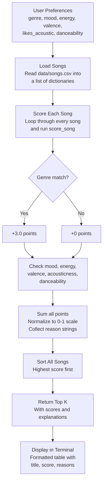

# 🎵 Music Recommender Simulation

## Project Summary

In this project you will build and explain a small music recommender system.

Your goal is to:

- Represent songs and a user "taste profile" as data
- Design a scoring rule that turns that data into recommendations
- Evaluate what your system gets right and wrong
- Reflect on how this mirrors real world AI recommenders

So basically what I built here is a simple music recommender that looks at what kind of music you say you like and then tries to find the best matches from a small catalog of 20 songs. It checks things like genre, mood, energy level, and a few other song traits, scores each song based on how close it is to your taste, and gives you the top picks along with a short explanation for why it chose each one.

---

## How The System Works

The way real apps like Spotify work is they combine two main approaches. One is collaborative filtering, which is basically looking at what other people with similar taste listened to and recommending that to you. The other is content-based filtering, where the system looks at the actual attributes of songs you already like (tempo, energy, mood, etc.) and finds other songs with similar traits. Most real platforms use both together plus a bunch of machine learning on top.

For this project I went with just content-based filtering since we don't have other users to compare against. It keeps things simple and you can actually see why the system made each recommendation, which I think is cool.

### What each Song has

Every song in `data/songs.csv` has these attributes:

- **genre** - the main category like pop, lofi, rock, hip-hop, etc. (14 different genres in the catalog)
- **mood** - the vibe of the track like happy, chill, intense, melancholy, angry, etc.
- **energy** - how intense or calm it feels, on a 0 to 1 scale
- **tempo_bpm** - the speed in beats per minute
- **valence** - basically how positive or dark the song sounds (0 = sad/heavy, 1 = bright/upbeat)
- **danceability** - how much it makes you want to move
- **acousticness** - whether it sounds more acoustic/organic or electronic/produced

### What the UserProfile stores

The user profile is how the system knows what you're into:

- **favorite_genre** - your go-to genre
- **favorite_mood** - the mood you usually gravitate toward
- **target_energy** - your ideal energy level
- **likes_acoustic** - whether you prefer acoustic sounding stuff or not
- **target_valence** - how positive you want the music to feel
- **target_danceability** - how danceable you want it

### The Algorithm Recipe

Here's how the scoring actually works. For every song in the catalog, the system calculates a score based on these rules:

- **Genre match: +3.0 points** if the song's genre matches your favorite. This is weighted the heaviest because honestly if you're a rock person and the system recommends ambient music, that just feels wrong no matter how close the other numbers are.
- **Mood match: +2.0 points** if the mood lines up. Important but not as make-or-break as genre since moods can overlap a bit.
- **Energy closeness: up to +1.5 points** using the formula `1 - |song energy - your target|`. So if you want 0.9 energy and a song is at 0.88, that's almost full points. A song at 0.3 barely gets anything.
- **Valence closeness: up to +1.0 points** same idea, rewards songs that match how positive or dark you want things.
- **Acousticness: +1.0 points** if the song's acoustic level lines up with your preference.
- **Danceability closeness: up to +0.5 points** a smaller factor, mostly helps break ties between songs that are close on everything else.

The max possible score is 9.0 points. I normalize it to a 0-1 scale at the end. Then all the songs get sorted highest to lowest and the system returns the top 5 (or however many you ask for) with explanations.

### Data Flow Diagram



### Potential biases I'm expecting

Being real about it, this system has some built-in biases I can already see:

- **It's going to over-prioritize genre.** With genre worth 3 points, a perfect genre match with mediocre everything else will often beat a song that nails mood + energy + valence but is in the wrong genre. That means you might miss some great songs that fit your vibe but happen to be in a different category.
- **The catalog itself is biased.** I picked the songs, so they reflect my idea of what different genres sound like. Someone else might define "chill" or "intense" totally differently.
- **It treats everyone the same shape.** Some people care way more about mood than genre, or they like variety and don't want 5 songs that all sound identical. This system doesn't adapt to that at all.
- **No discovery factor.** Real recommenders throw in some surprises on purpose. This one just gives you the closest matches every time, which could get boring fast.

---

## Getting Started

### Setup

1. Create a virtual environment (optional but recommended):

   ```bash
   python -m venv .venv
   source .venv/bin/activate      # Mac or Linux
   .venv\Scripts\activate         # Windows

2. Install dependencies

```bash
pip install -r requirements.txt
```

3. Run the app:

```bash
python -m src.main
```

### Sample Output

Here's what the terminal looks like when you run it:

```text
Loaded songs: 20

============================================================
  Profile A: Rock Fan
  Prefs: rock | intense | energy=0.9
============================================================
  #    Title                  Artist              Score
  ------------------------------------------------------
  1    Storm Runner           Voltline            0.99
       -> genre match (+3.0)
       -> mood match (+2.0)
       -> energy closeness (+1.49)
       -> valence closeness (+0.97)
       -> acoustic preference match (+1.0)
       -> danceability closeness (+0.49)

  2    Street Cipher          Lex Vega            0.63
       -> mood match (+2.0)
       -> energy closeness (+1.47)
       -> valence closeness (+0.83)
       -> acoustic preference match (+1.0)
       -> danceability closeness (+0.40)

============================================================
  Profile B: Lofi Chill Listener
  Prefs: lofi | chill | energy=0.35
============================================================
  #    Title                  Artist              Score
  ------------------------------------------------------
  1    Library Rain           Paper Lanterns      1.00
       -> genre match (+3.0)
       -> mood match (+2.0)
       -> energy closeness (+1.50)
       -> valence closeness (+1.00)
       -> acoustic preference match (+1.0)
       -> danceability closeness (+0.48)

  2    Midnight Coding        LoRoom              0.98
       -> genre match (+3.0)
       -> mood match (+2.0)
       -> energy closeness (+1.40)
       -> valence closeness (+0.96)
       -> acoustic preference match (+1.0)
       -> danceability closeness (+0.47)

============================================================
  Profile C: Pop Dancer
  Prefs: pop | happy | energy=0.8
============================================================
  #    Title                  Artist              Score
  ------------------------------------------------------
  1    Sunrise City           Neon Echo           0.99
       -> genre match (+3.0)
       -> mood match (+2.0)
       -> energy closeness (+1.47)
       -> valence closeness (+0.99)
       -> acoustic preference match (+1.0)
       -> danceability closeness (+0.46)

  2    Gym Hero               Max Pulse           0.75
       -> genre match (+3.0)
       -> energy closeness (+1.30)
       -> valence closeness (+0.92)
       -> acoustic preference match (+1.0)
       -> danceability closeness (+0.50)
```

### Running Tests

Run the starter tests with:

```bash
pytest
```

You can add more tests in `tests/test_recommender.py`.

---

## Experiments I Tried

I ran the recommender with three different user profiles to see how it handled different tastes:

- **Rock Fan profile** (genre=rock, mood=intense, energy=0.9): Storm Runner came in first with a near-perfect 0.99 score, which makes total sense. Street Cipher (hip-hop, intense) came second at 0.63 — it got the mood bonus but missed on genre. That 0.36 gap between first and second really shows how much the genre weight dominates.

- **Lofi Chill profile** (genre=lofi, mood=chill, energy=0.35): Library Rain scored a perfect 1.0 and Midnight Coding was right behind at 0.98. Both are lofi and chill so they got the full genre + mood bonus. Focus Flow (lofi but "focused" mood) dropped to 0.77 because it missed the mood match — losing those 2 points hurts.

- **Pop Dancer profile** (genre=pop, mood=happy, energy=0.8): Sunrise City took the top spot at 0.99. Interestingly, Fuego Lento (latin, happy) beat out Rooftop Lights (indie pop, happy) even though neither matched the genre. They both got the mood bonus but Fuego's energy was a slightly closer match.

One thing I noticed is that the system never recommends anything surprising. If you say you like rock, you get rock. There's no "you might also like this metal track" kind of logic, which a real recommender would probably do.

---

## Limitations and Risks

- **Tiny catalog.** 20 songs is nothing. In a real scenario you'd have millions, and the brute-force loop through every song wouldn't scale at all. You'd need indexing or some kind of pre-filtering.
- **Genre dominance.** Genre is worth 3 points out of 9, so it basically controls a third of the score by itself. A mediocre pop song will almost always beat an amazing jazz song for a pop listener, even if the jazz track matches everything else perfectly.
- **No understanding of lyrics or language.** The system has no idea what a song is actually about. Two songs could be in the same genre with the same mood tag but one is about heartbreak and the other is a party anthem.
- **Single rigid profile.** Real people's taste changes depending on the time of day, what they're doing, or just their mood in the moment. This system assumes you always want the same thing.
- **My bias is baked into the data.** I picked all 20 songs and assigned their mood/energy/valence values by hand. Someone else might label the same songs completely differently, and the recommendations would change.
- **No serendipity.** The system just gives you the mathematically closest matches every time. Real recommenders intentionally throw in some wildcards to help you discover new stuff.

---

## Reflection

Read and complete `model_card.md`:

[**Model Card**](model_card.md)

Write 1 to 2 paragraphs here about what you learned:

- about how recommenders turn data into predictions
- about where bias or unfairness could show up in systems like this


---

## 7. `model_card_template.md`

Combines reflection and model card framing from the Module 3 guidance. :contentReference[oaicite:2]{index=2}  

```markdown
# 🎧 Model Card - Music Recommender Simulation

## 1. Model Name

Give your recommender a name, for example:

> VibeFinder 1.0

---

## 2. Intended Use

- What is this system trying to do
- Who is it for

Example:

> This model suggests 3 to 5 songs from a small catalog based on a user's preferred genre, mood, and energy level. It is for classroom exploration only, not for real users.

---

## 3. How It Works (Short Explanation)

Describe your scoring logic in plain language.

- What features of each song does it consider
- What information about the user does it use
- How does it turn those into a number

Try to avoid code in this section, treat it like an explanation to a non programmer.

---

## 4. Data

Describe your dataset.

- How many songs are in `data/songs.csv`
- Did you add or remove any songs
- What kinds of genres or moods are represented
- Whose taste does this data mostly reflect

---

## 5. Strengths

Where does your recommender work well

You can think about:
- Situations where the top results "felt right"
- Particular user profiles it served well
- Simplicity or transparency benefits

---

## 6. Limitations and Bias

Where does your recommender struggle

Some prompts:
- Does it ignore some genres or moods
- Does it treat all users as if they have the same taste shape
- Is it biased toward high energy or one genre by default
- How could this be unfair if used in a real product

---

## 7. Evaluation

How did you check your system

Examples:
- You tried multiple user profiles and wrote down whether the results matched your expectations
- You compared your simulation to what a real app like Spotify or YouTube tends to recommend
- You wrote tests for your scoring logic

You do not need a numeric metric, but if you used one, explain what it measures.

---

## 8. Future Work

If you had more time, how would you improve this recommender

Examples:

- Add support for multiple users and "group vibe" recommendations
- Balance diversity of songs instead of always picking the closest match
- Use more features, like tempo ranges or lyric themes

---

## 9. Personal Reflection

A few sentences about what you learned:

- What surprised you about how your system behaved
- How did building this change how you think about real music recommenders
- Where do you think human judgment still matters, even if the model seems "smart"

