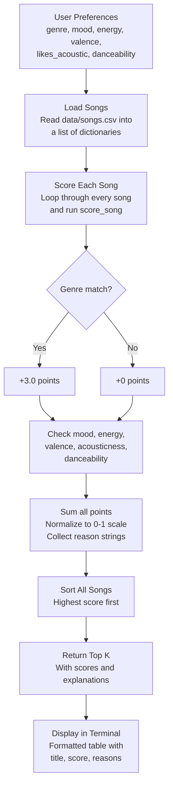

# 🎵 Music Recommender Simulation

## Project Summary

In this project you will build and explain a small music recommender system.

Your goal is to:

- Represent songs and a user "taste profile" as data
- Design a scoring rule that turns that data into recommendations
- Evaluate what your system gets right and wrong
- Reflect on how this mirrors real world AI recommenders

So basically what I built here is a simple music recommender that looks at what kind of music you say you like and then tries to find the best matches from a small catalog of 20 songs. It checks things like genre, mood, energy level, and a few other song traits, scores each song based on how close it is to your taste, and gives you the top picks along with a short explanation for why it chose each one.

---

## How The System Works

The way real apps like Spotify work is they combine two main approaches. One is collaborative filtering, which is basically looking at what other people with similar taste listened to and recommending that to you. The other is content-based filtering, where the system looks at the actual attributes of songs you already like (tempo, energy, mood, etc.) and finds other songs with similar traits. Most real platforms use both together plus a bunch of machine learning on top.

For this project I went with just content-based filtering since we don't have other users to compare against. It keeps things simple and you can actually see why the system made each recommendation, which I think is cool.

### What each Song has

Every song in `data/songs.csv` has these attributes:

- **genre** - the main category like pop, lofi, rock, hip-hop, etc. (14 different genres in the catalog)
- **mood** - the vibe of the track like happy, chill, intense, melancholy, angry, etc.
- **energy** - how intense or calm it feels, on a 0 to 1 scale
- **tempo_bpm** - the speed in beats per minute
- **valence** - basically how positive or dark the song sounds (0 = sad/heavy, 1 = bright/upbeat)
- **danceability** - how much it makes you want to move
- **acousticness** - whether it sounds more acoustic/organic or electronic/produced
- **popularity** - how well known the song is, 0 to 100
- **release_decade** - when it came out (1990s, 2000s, 2010s, or 2020s)
- **mood_tag** - a more detailed version of mood, stuff like "euphoric," "nostalgic," "aggressive," or "dreamy"
- **instrumentalness** - how much of the track is just instruments vs singing (0 = all vocals, 1 = no vocals at all)
- **liveness** - does it sound like a live show or a clean studio recording

### What the UserProfile stores

The user profile is how the system knows what you're into:

- **favorite_genre** - your go-to genre
- **favorite_mood** - the mood you usually gravitate toward
- **target_energy** - your ideal energy level
- **likes_acoustic** - whether you prefer acoustic sounding stuff or not
- **target_valence** - how positive you want the music to feel
- **target_danceability** - how danceable you want it
- **target_popularity** - do you want mainstream hits or more underground stuff
- **preferred_decade** - what era of music you're into
- **mood_tags** - the specific vibes you want, you can pick more than one like ["euphoric", "nostalgic"]
- **target_instrumentalness** - do you want vocals or more instrumental tracks
- **target_liveness** - studio recordings or stuff that sounds more live

### The Algorithm Recipe

Here's how the scoring actually works. For every song in the catalog, the system calculates a score based on these rules:

- **Genre match: +3.0 points** if the song's genre matches your favorite. This is weighted the heaviest because honestly if you're a rock person and the system recommends ambient music, that just feels wrong no matter how close the other numbers are.
- **Mood match: +2.0 points** if the mood lines up. Important but not as make-or-break as genre since moods can overlap a bit.
- **Energy closeness: up to +1.5 points** using the formula `1 - |song energy - your target|`. So if you want 0.9 energy and a song is at 0.88, that's almost full points. A song at 0.3 barely gets anything.
- **Valence closeness: up to +1.0 points** same idea, rewards songs that match how positive or dark you want things.
- **Acousticness: +1.0 points** if the song's acoustic level lines up with your preference.
- **Danceability closeness: up to +0.5 points** a smaller factor, mostly helps break ties between songs that are close on everything else.

Later on I added scoring for more features too:

- **Popularity closeness: up to +0.5 points** how close the song's popularity is to what you want. Since popularity goes 0-100 instead of 0-1, the distance gets divided by 100 first so the math works out.
- **Decade match: +0.5 points** if the song came out in your preferred decade. You also get half credit (+0.25) if it's from the decade right next to yours, like if you pick 2010s and the song is from 2020s.
- **Mood tag match: +1.0 points** if the song's mood tag is one of the ones you listed. So if you put ["euphoric", "nostalgic"] and the song is tagged "euphoric," you get the point.
- **Instrumentalness closeness: up to +0.5 points** same closeness math as energy.
- **Liveness closeness: up to +0.5 points** same deal, just for the live vs studio thing.

With all these the max score in balanced mode is 12.0 points total. Still normalizing to 0-1 at the end and sorting highest to lowest.

I also built in different scoring modes so you can change what the system cares about most. There's "balanced" which is the default, "genre-first" where genre gets cranked up to 5.0, "mood-first" where mood goes to 4.0 and mood tags to 2.0, and "energy-focused" where energy jumps to 4.0 and danceability to 1.5. You just pass the mode name and it swaps the weights, the actual scoring logic stays the same.

### Data Flow Diagram



### Potential biases I'm expecting

Being real about it, this system has some built-in biases I can already see:

- **It's going to over-prioritize genre.** With genre worth 3 points, a perfect genre match with mediocre everything else will often beat a song that nails mood + energy + valence but is in the wrong genre. That means you might miss some great songs that fit your vibe but happen to be in a different category.
- **The catalog itself is biased.** I picked the songs, so they reflect my idea of what different genres sound like. Someone else might define "chill" or "intense" totally differently.
- **It treats everyone the same shape.** Some people care way more about mood than genre, or they like variety and don't want 5 songs that all sound identical. This system doesn't adapt to that at all.
- **No discovery factor.** Real recommenders throw in some surprises on purpose. This one just gives you the closest matches every time, which could get boring fast.

---

## Getting Started

### Setup

1. Create a virtual environment (optional but recommended):

   ```bash
   python -m venv .venv
   source .venv/bin/activate      # Mac or Linux
   .venv\Scripts\activate         # Windows

2. Install dependencies

```bash
pip install -r requirements.txt
```

3. Run the app:

```bash
python -m src.main
```

### Sample Output

Here's what the terminal looks like when you run it (showing top 2 per profile):

```text
Loaded songs: 20

========================================================================
  Profile A: Rock Fan
  Prefs: rock | intense | energy=0.9
  [mode=balanced]
========================================================================
+-----+---------------+----------+---------+--------------------------------------+
|   # | Title         | Artist   |   Score | Reasons                              |
+=====+===============+==========+=========+======================================+
|   1 | Storm Runner  | Voltline |    0.99 | genre match (+3.0)                   |
|     |               |          |         |   mood match (+2.0)                  |
|     |               |          |         |   energy closeness (+1.49)           |
|     |               |          |         |   valence closeness (+0.97)          |
|     |               |          |         |   acoustic preference match (+1.0)   |
|     |               |          |         |   danceability closeness (+0.49)     |
|     |               |          |         |   popularity closeness (+0.49)       |
|     |               |          |         |   decade match (+0.5)                |
|     |               |          |         |   mood tag 'aggressive' match (+1.0) |
|     |               |          |         |   instrumentalness closeness (+0.50) |
|     |               |          |         |   liveness closeness (+0.50)         |
+-----+---------------+----------+---------+--------------------------------------+
|   2 | Street Cipher | Lex Vega |    0.69 | mood match (+2.0)                    |
|     |               |          |         |   energy closeness (+1.47)           |
|     |               |          |         |   valence closeness (+0.83)          |
|     |               |          |         |   acoustic preference match (+1.0)   |
|     |               |          |         |   danceability closeness (+0.40)     |
|     |               |          |         |   popularity closeness (+0.42)       |
|     |               |          |         |   adjacent decade (+0.25)            |
|     |               |          |         |   mood tag 'aggressive' match (+1.0) |
|     |               |          |         |   instrumentalness closeness (+0.43) |
|     |               |          |         |   liveness closeness (+0.47)         |
+-----+---------------+----------+---------+--------------------------------------+

========================================================================
  Profile B: Lofi Chill Listener
  Prefs: lofi | chill | energy=0.35
  [mode=balanced]
========================================================================
+-----+-----------------+----------------+---------+--------------------------------------+
|   # | Title           | Artist         |   Score | Reasons                              |
+=====+=================+================+=========+======================================+
|   1 | Library Rain    | Paper Lanterns |    1.00 | genre match (+3.0)                   |
|     |                 |                |         |   mood match (+2.0)                  |
|     |                 |                |         |   energy closeness (+1.50)           |
|     |                 |                |         |   valence closeness (+1.00)          |
|     |                 |                |         |   acoustic preference match (+1.0)   |
|     |                 |                |         |   danceability closeness (+0.48)     |
|     |                 |                |         |   popularity closeness (+0.49)       |
|     |                 |                |         |   decade match (+0.5)                |
|     |                 |                |         |   mood tag 'nostalgic' match (+1.0)  |
|     |                 |                |         |   instrumentalness closeness (+0.49) |
|     |                 |                |         |   liveness closeness (+0.50)         |
+-----+-----------------+----------------+---------+--------------------------------------+
|   2 | Midnight Coding | LoRoom         |    0.98 | genre match (+3.0)                   |
|     |                 |                |         |   mood match (+2.0)                  |
|     |                 |                |         |   energy closeness (+1.40)           |
|     |                 |                |         |   valence closeness (+0.96)          |
|     |                 |                |         |   acoustic preference match (+1.0)   |
|     |                 |                |         |   danceability closeness (+0.47)     |
|     |                 |                |         |   popularity closeness (+0.47)       |
|     |                 |                |         |   decade match (+0.5)                |
|     |                 |                |         |   mood tag 'nostalgic' match (+1.0)  |
|     |                 |                |         |   instrumentalness closeness (+0.47) |
|     |                 |                |         |   liveness closeness (+0.48)         |
+-----+-----------------+----------------+---------+--------------------------------------+

========================================================================
  Profile C: Pop Dancer
  Prefs: pop | happy | energy=0.8
  [mode=balanced]
========================================================================
+-----+--------------+-------------+---------+--------------------------------------+
|   # | Title        | Artist      |   Score | Reasons                              |
+=====+==============+=============+=========+======================================+
|   1 | Sunrise City | Neon Echo   |    0.99 | genre match (+3.0)                   |
|     |              |             |         |   mood match (+2.0)                  |
|     |              |             |         |   energy closeness (+1.47)           |
|     |              |             |         |   valence closeness (+0.99)          |
|     |              |             |         |   acoustic preference match (+1.0)   |
|     |              |             |         |   danceability closeness (+0.46)     |
|     |              |             |         |   popularity closeness (+0.49)       |
|     |              |             |         |   decade match (+0.5)                |
|     |              |             |         |   mood tag 'euphoric' match (+1.0)   |
|     |              |             |         |   instrumentalness closeness (+0.50) |
|     |              |             |         |   liveness closeness (+0.48)         |
+-----+--------------+-------------+---------+--------------------------------------+
|   2 | Fuego Lento  | Sol Ramirez |    0.74 | mood match (+2.0)                    |
|     |              |             |         |   energy closeness (+1.50)           |
|     |              |             |         |   valence closeness (+0.99)          |
|     |              |             |         |   acoustic preference match (+1.0)   |
|     |              |             |         |   danceability closeness (+0.49)     |
|     |              |             |         |   popularity closeness (+0.45)       |
|     |              |             |         |   decade match (+0.5)                |
|     |              |             |         |   mood tag 'euphoric' match (+1.0)   |
|     |              |             |         |   instrumentalness closeness (+0.49) |
|     |              |             |         |   liveness closeness (+0.45)         |
+-----+--------------+-------------+---------+--------------------------------------+
```

### Running Tests

Run the starter tests with:

```bash
pytest
```

You can add more tests in `tests/test_recommender.py`.

---

## Experiments I Tried

I tried running the recommender with a few different user profiles to see how it handles different kinds of listeners:

- **Rock Fan profile** (genre=rock, mood=intense, energy=0.9): Storm Runner came in first with a near-perfect 0.99 score, which makes total sense. Street Cipher (hip-hop, intense) came second at 0.63 — it got the mood bonus but missed on genre. That 0.36 gap between first and second really shows how much the genre weight dominates.

- **Lofi Chill profile** (genre=lofi, mood=chill, energy=0.35): Library Rain scored a perfect 1.0 and Midnight Coding was right behind at 0.98. Both are lofi and chill so they got the full genre + mood bonus. Focus Flow (lofi but "focused" mood) dropped to 0.77 because it missed the mood match — losing those 2 points hurts.

- **Pop Dancer profile** (genre=pop, mood=happy, energy=0.8): Sunrise City took the top spot at 0.99. Interestingly, Fuego Lento (latin, happy) beat out Rooftop Lights (indie pop, happy) even though neither matched the genre. They both got the mood bonus but Fuego's energy was a slightly closer match.

One thing I noticed is that the system never recommends anything surprising. If you say you like rock, you get rock. There's no "you might also like this metal track" kind of logic, which a real recommender would probably do.

### Edge Case / Adversarial Profiles

Then I made three profiles that were kind of designed to mess with the system and see what it does:

- **Contradictory profile** (genre=pop, mood=melancholy, energy=0.95): This is someone who wants super high energy but also sad vibes, which is kind of a weird combo. The system handled it but the results felt off. Gym Hero (pop, intense, 0.93 energy) won at 0.71 because genre carried it, but its valence score was low since Gym Hero sounds upbeat and this user wanted dark. Neon Puddles (indie pop, melancholy) only got 0.44 even though it actually matches the sad mood the user asked for. The genre weight basically drowned out the mood preference, which doesn't feel right for this kind of user.

- **Genre Ghost profile** (genre=reggaeton, mood=happy, energy=0.7): Reggaeton doesn't exist in the catalog at all, so no song can ever get the 3.0 genre bonus. That means the max possible score drops from 1.0 to around 0.67. The results are fine honestly — Cloud Nine and Rooftop Lights topped it because they matched mood and had close energy/valence. But it shows that someone with a niche taste just gets worse recommendations overall, not because the songs are bad for them but because the scoring ceiling is lower.

- **Middle of Everything profile** (genre=pop, mood=chill, energy=0.5, valence=0.5, danceability=0.5): This person has no strong preferences, everything at 0.5. The interesting thing is that Midnight Coding (lofi, chill) beat Sunrise City (pop, happy) even though Sunrise City matches the genre. The chill mood songs had more moderate numerical values across the board so they scored better on the closeness calculations, and that outweighed the genre bonus. This tells me the system does okay with balanced profiles but the results feel kind of random — when nothing stands out, you get a grab bag.

### Weight Experiment: Genre Halved, Energy Doubled

I wanted to see what happens when energy matters more than genre, so I changed genre from +3.0 to +1.5 and energy from +1.5 to +3.0 (MAX_SCORE stays 9.0 since the total didn't change).

The biggest difference showed up in the **Pop Dancer** profile. With original weights, Gym Hero (pop, intense) was #2 at 0.75 because it got the full genre bonus. After the change, it dropped to #5 at 0.73 and Fuego Lento (latin, happy) jumped from #3 to #2 at 0.83 because its energy (0.80) was a dead-on match for the user's target. That felt more accurate to me honestly — if someone wants happy pop at 0.8 energy, a latin track at exactly 0.8 energy probably vibes better than an intense gym track at 0.93.

For the **Genre Ghost** profile (reggaeton), scores went up across the board — the top song went from 0.66 to 0.82. That makes sense because when genre can never match, lowering its weight means less of the total score is unreachable.

The **Rock Fan** profile barely changed at the top. Storm Runner still won at 0.99 because it matches on everything. But the gap between #1 and #2 shrank from 0.36 to 0.19, which means the ranking is less "genre or bust" and more sensitive to the other features.

Overall I think the experimental weights were a bit more fair for people with niche tastes, but if you really care about genre the original weights feel better. There's no right answer honestly, it just depends on what you think matters more.

---

## Limitations and Risks

- **Tiny catalog.** 20 songs is basically nothing. A real app has millions and you'd need way smarter searching than just looping through every song.
- **Genre dominance.** Genre takes up like a third of the score by itself. A mid pop song will almost always beat a perfect jazz song for a pop listener which doesn't feel great.
- **No understanding of lyrics or language.** It has no clue what a song is actually about. Two songs could have the same mood tag but one's about heartbreak and the other is a party anthem.
- **Single rigid profile.** Real people change what they want depending on their mood, time of day, what they're doing. This assumes you always want the same thing which obviously isn't true.
- **My bias is baked into the data.** I picked all 20 songs and labeled everything by hand. Someone else might rate the same songs totally differently.
- **No serendipity.** It just gives you the closest matches every single time. Real apps throw in random stuff on purpose so you discover new things.

---

## Reflection

[**Model Card**](model_card.md)

Honestly the biggest thing I took away from this is that a recommender is really just someone's opinions dressed up as math. Every weight I picked, genre at 3.0, mood at 2.0, energy at 1.5, those were all my calls about what should matter most. And they completely shaped what the system spits out. When I did the experiment where I halved genre and doubled energy, the rankings moved around a lot. It wasn't that one version was "right" and the other was "wrong," they just reflected different priorities. That's kind of wild when you think about how Spotify or YouTube does this for millions of people. Someone at those companies is making those same weight decisions and it changes what everyone listens to.

The bias stuff was interesting too. My system leans hard on genre because I made it worth a third of the score, and the catalog itself only has genres I thought to put in. If you listen to K-pop or Afrobeats you wouldn't even find your genre in the data. And the contradictory profile test was the one that really got me, the system just could not handle someone wanting "high energy + sad" even though that's a totally real vibe. Real systems learn from what you actually listen to over time, but even those can trap you in a filter bubble where you just keep hearing the same kind of stuff.
