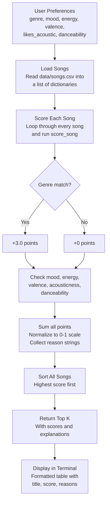

# 🎵 Music Recommender Simulation

## Project Summary

In this project you will build and explain a small music recommender system.

Your goal is to:

- Represent songs and a user "taste profile" as data
- Design a scoring rule that turns that data into recommendations
- Evaluate what your system gets right and wrong
- Reflect on how this mirrors real world AI recommenders

So basically what I built here is a simple music recommender that looks at what kind of music you say you like and then tries to find the best matches from a small catalog of 20 songs. It checks things like genre, mood, energy level, and a few other song traits, scores each song based on how close it is to your taste, and gives you the top picks along with a short explanation for why it chose each one.

---

## How The System Works

The way real apps like Spotify work is they combine two main approaches. One is collaborative filtering, which is basically looking at what other people with similar taste listened to and recommending that to you. The other is content-based filtering, where the system looks at the actual attributes of songs you already like (tempo, energy, mood, etc.) and finds other songs with similar traits. Most real platforms use both together plus a bunch of machine learning on top.

For this project I went with just content-based filtering since we don't have other users to compare against. It keeps things simple and you can actually see why the system made each recommendation, which I think is cool.

### What each Song has

Every song in `data/songs.csv` has these attributes:

- **genre** - the main category like pop, lofi, rock, hip-hop, etc. (14 different genres in the catalog)
- **mood** - the vibe of the track like happy, chill, intense, melancholy, angry, etc.
- **energy** - how intense or calm it feels, on a 0 to 1 scale
- **tempo_bpm** - the speed in beats per minute
- **valence** - basically how positive or dark the song sounds (0 = sad/heavy, 1 = bright/upbeat)
- **danceability** - how much it makes you want to move
- **acousticness** - whether it sounds more acoustic/organic or electronic/produced
- **popularity** - how well known the song is, on a 0 to 100 scale
- **release_decade** - when the song came out (1990s, 2000s, 2010s, 2020s)
- **mood_tag** - a more specific emotional label like "euphoric," "nostalgic," "aggressive," or "dreamy"
- **instrumentalness** - how much of the track is instrumental vs vocal (0 = all vocals, 1 = no vocals)
- **liveness** - whether it sounds like a live performance or a studio recording

### What the UserProfile stores

The user profile is how the system knows what you're into:

- **favorite_genre** - your go-to genre
- **favorite_mood** - the mood you usually gravitate toward
- **target_energy** - your ideal energy level
- **likes_acoustic** - whether you prefer acoustic sounding stuff or not
- **target_valence** - how positive you want the music to feel
- **target_danceability** - how danceable you want it
- **target_popularity** - whether you want mainstream hits or underground stuff
- **preferred_decade** - what era of music you lean toward
- **mood_tags** - specific emotional vibes you're looking for (can pick multiple)
- **target_instrumentalness** - how much you want vocals vs pure instrumentals
- **target_liveness** - whether you prefer studio polish or live energy

### The Algorithm Recipe

Here's how the scoring actually works. For every song in the catalog, the system calculates a score based on these rules:

- **Genre match: +3.0 points** if the song's genre matches your favorite. This is weighted the heaviest because honestly if you're a rock person and the system recommends ambient music, that just feels wrong no matter how close the other numbers are.
- **Mood match: +2.0 points** if the mood lines up. Important but not as make-or-break as genre since moods can overlap a bit.
- **Energy closeness: up to +1.5 points** using the formula `1 - |song energy - your target|`. So if you want 0.9 energy and a song is at 0.88, that's almost full points. A song at 0.3 barely gets anything.
- **Valence closeness: up to +1.0 points** same idea, rewards songs that match how positive or dark you want things.
- **Acousticness: +1.0 points** if the song's acoustic level lines up with your preference.
- **Danceability closeness: up to +0.5 points** a smaller factor, mostly helps break ties between songs that are close on everything else.

I also added scoring for the newer features:

- **Popularity closeness: up to +0.5 points** based on how close the song's popularity is to what you want. Uses a 0-100 scale so the distance gets divided by 100 first.
- **Decade match: +0.5 points** if the song came out in your preferred decade, or +0.25 if it's from an adjacent decade (like if you prefer 2010s, a 2020s song still gets partial credit).
- **Mood tag match: +1.0 points** if the song's detailed mood tag (like "euphoric" or "aggressive") is one of the tags in your profile.
- **Instrumentalness closeness: up to +0.5 points** same closeness formula as energy.
- **Liveness closeness: up to +0.5 points** rewards songs that match whether you want studio or live sounding tracks.

The max possible score in balanced mode is 12.0 points. I normalize it to a 0-1 scale at the end. Then all the songs get sorted highest to lowest and the system returns the top 5 (or however many you ask for) with explanations.

The system also supports multiple scoring modes — you can switch between "balanced" (default), "genre-first" (genre weight cranked to 5.0), "mood-first" (mood at 4.0, mood tags at 2.0), and "energy-focused" (energy at 4.0, danceability at 1.5). Each mode just swaps the weights around without changing the actual algorithm.

### Data Flow Diagram



### Potential biases I'm expecting

Being real about it, this system has some built-in biases I can already see:

- **It's going to over-prioritize genre.** With genre worth 3 points, a perfect genre match with mediocre everything else will often beat a song that nails mood + energy + valence but is in the wrong genre. That means you might miss some great songs that fit your vibe but happen to be in a different category.
- **The catalog itself is biased.** I picked the songs, so they reflect my idea of what different genres sound like. Someone else might define "chill" or "intense" totally differently.
- **It treats everyone the same shape.** Some people care way more about mood than genre, or they like variety and don't want 5 songs that all sound identical. This system doesn't adapt to that at all.
- **No discovery factor.** Real recommenders throw in some surprises on purpose. This one just gives you the closest matches every time, which could get boring fast.

---

## Getting Started

### Setup

1. Create a virtual environment (optional but recommended):

   ```bash
   python -m venv .venv
   source .venv/bin/activate      # Mac or Linux
   .venv\Scripts\activate         # Windows

2. Install dependencies

```bash
pip install -r requirements.txt
```

3. Run the app:

```bash
python -m src.main
```

### Sample Output

Here's what the terminal looks like when you run it:

```text
Loaded songs: 20

============================================================
  Profile A: Rock Fan
  Prefs: rock | intense | energy=0.9
============================================================
  #    Title                  Artist              Score
  ------------------------------------------------------
  1    Storm Runner           Voltline            0.99
       -> genre match (+3.0)
       -> mood match (+2.0)
       -> energy closeness (+1.49)
       -> valence closeness (+0.97)
       -> acoustic preference match (+1.0)
       -> danceability closeness (+0.49)

  2    Street Cipher          Lex Vega            0.63
       -> mood match (+2.0)
       -> energy closeness (+1.47)
       -> valence closeness (+0.83)
       -> acoustic preference match (+1.0)
       -> danceability closeness (+0.40)

============================================================
  Profile B: Lofi Chill Listener
  Prefs: lofi | chill | energy=0.35
============================================================
  #    Title                  Artist              Score
  ------------------------------------------------------
  1    Library Rain           Paper Lanterns      1.00
       -> genre match (+3.0)
       -> mood match (+2.0)
       -> energy closeness (+1.50)
       -> valence closeness (+1.00)
       -> acoustic preference match (+1.0)
       -> danceability closeness (+0.48)

  2    Midnight Coding        LoRoom              0.98
       -> genre match (+3.0)
       -> mood match (+2.0)
       -> energy closeness (+1.40)
       -> valence closeness (+0.96)
       -> acoustic preference match (+1.0)
       -> danceability closeness (+0.47)

============================================================
  Profile C: Pop Dancer
  Prefs: pop | happy | energy=0.8
============================================================
  #    Title                  Artist              Score
  ------------------------------------------------------
  1    Sunrise City           Neon Echo           0.99
       -> genre match (+3.0)
       -> mood match (+2.0)
       -> energy closeness (+1.47)
       -> valence closeness (+0.99)
       -> acoustic preference match (+1.0)
       -> danceability closeness (+0.46)

  2    Gym Hero               Max Pulse           0.75
       -> genre match (+3.0)
       -> energy closeness (+1.30)
       -> valence closeness (+0.92)
       -> acoustic preference match (+1.0)
       -> danceability closeness (+0.50)

============================================================
  Profile D: Contradictory (high energy + sad mood)
  Prefs: pop | melancholy | energy=0.95
============================================================
  #    Title                  Artist              Score
  ------------------------------------------------------
  1    Gym Hero               Max Pulse           0.71
       -> genre match (+3.0)
       -> energy closeness (+1.47)
       -> valence closeness (+0.43)
       -> acoustic preference match (+1.0)
       -> danceability closeness (+0.46)

  2    Sunrise City           Neon Echo           0.68
       -> genre match (+3.0)
       -> energy closeness (+1.30)
       -> valence closeness (+0.36)
       -> acoustic preference match (+1.0)
       -> danceability closeness (+0.49)

============================================================
  Profile E: Genre Ghost (genre not in catalog)
  Prefs: reggaeton | happy | energy=0.7
============================================================
  #    Title                  Artist              Score
  ------------------------------------------------------
  1    Cloud Nine             Ava Lune            0.66
       -> mood match (+2.0)
       -> energy closeness (+1.47)
       -> valence closeness (+0.98)
       -> acoustic preference match (+1.0)
       -> danceability closeness (+0.46)

  2    Rooftop Lights         Indigo Parade       0.65
       -> mood match (+2.0)
       -> energy closeness (+1.41)
       -> valence closeness (+0.99)
       -> acoustic preference match (+1.0)
       -> danceability closeness (+0.48)

============================================================
  Profile F: Middle of Everything (all 0.5)
  Prefs: pop | chill | energy=0.5
============================================================
  #    Title                  Artist              Score
  ------------------------------------------------------
  1    Midnight Coding        LoRoom              0.64
       -> mood match (+2.0)
       -> energy closeness (+1.38)
       -> valence closeness (+0.94)
       -> acoustic preference match (+1.0)
       -> danceability closeness (+0.44)

  2    Library Rain           Paper Lanterns      0.63
       -> mood match (+2.0)
       -> energy closeness (+1.27)
       -> valence closeness (+0.90)
       -> acoustic preference match (+1.0)
       -> danceability closeness (+0.46)
```

### Running Tests

Run the starter tests with:

```bash
pytest
```

You can add more tests in `tests/test_recommender.py`.

---

## Experiments I Tried

I ran the recommender with three different user profiles to see how it handled different tastes:

- **Rock Fan profile** (genre=rock, mood=intense, energy=0.9): Storm Runner came in first with a near-perfect 0.99 score, which makes total sense. Street Cipher (hip-hop, intense) came second at 0.63 — it got the mood bonus but missed on genre. That 0.36 gap between first and second really shows how much the genre weight dominates.

- **Lofi Chill profile** (genre=lofi, mood=chill, energy=0.35): Library Rain scored a perfect 1.0 and Midnight Coding was right behind at 0.98. Both are lofi and chill so they got the full genre + mood bonus. Focus Flow (lofi but "focused" mood) dropped to 0.77 because it missed the mood match — losing those 2 points hurts.

- **Pop Dancer profile** (genre=pop, mood=happy, energy=0.8): Sunrise City took the top spot at 0.99. Interestingly, Fuego Lento (latin, happy) beat out Rooftop Lights (indie pop, happy) even though neither matched the genre. They both got the mood bonus but Fuego's energy was a slightly closer match.

One thing I noticed is that the system never recommends anything surprising. If you say you like rock, you get rock. There's no "you might also like this metal track" kind of logic, which a real recommender would probably do.

### Edge Case / Adversarial Profiles

I also ran three profiles that were specifically designed to break or confuse the system:

- **Contradictory profile** (genre=pop, mood=melancholy, energy=0.95): This is someone who wants super high energy but also sad vibes, which is kind of a weird combo. The system handled it but the results felt off. Gym Hero (pop, intense, 0.93 energy) won at 0.71 because genre carried it, but its valence score was low since Gym Hero sounds upbeat and this user wanted dark. Neon Puddles (indie pop, melancholy) only got 0.44 even though it actually matches the sad mood the user asked for. The genre weight basically drowned out the mood preference, which doesn't feel right for this kind of user.

- **Genre Ghost profile** (genre=reggaeton, mood=happy, energy=0.7): Reggaeton doesn't exist in the catalog at all, so no song can ever get the 3.0 genre bonus. That means the max possible score drops from 1.0 to around 0.67. The results are fine honestly — Cloud Nine and Rooftop Lights topped it because they matched mood and had close energy/valence. But it shows that someone with a niche taste just gets worse recommendations overall, not because the songs are bad for them but because the scoring ceiling is lower.

- **Middle of Everything profile** (genre=pop, mood=chill, energy=0.5, valence=0.5, danceability=0.5): This person has no strong preferences, everything at 0.5. The interesting thing is that Midnight Coding (lofi, chill) beat Sunrise City (pop, happy) even though Sunrise City matches the genre. The chill mood songs had more moderate numerical values across the board so they scored better on the closeness calculations, and that outweighed the genre bonus. This tells me the system does okay with balanced profiles but the results feel kind of random — when nothing stands out, you get a grab bag.

### Weight Experiment: Genre Halved, Energy Doubled

I wanted to see what happens when energy matters more than genre, so I changed genre from +3.0 to +1.5 and energy from +1.5 to +3.0 (MAX_SCORE stays 9.0 since the total didn't change).

The biggest difference showed up in the **Pop Dancer** profile. With original weights, Gym Hero (pop, intense) was #2 at 0.75 because it got the full genre bonus. After the change, it dropped to #5 at 0.73 and Fuego Lento (latin, happy) jumped from #3 to #2 at 0.83 because its energy (0.80) was a dead-on match for the user's target. That felt more accurate to me honestly — if someone wants happy pop at 0.8 energy, a latin track at exactly 0.8 energy probably vibes better than an intense gym track at 0.93.

For the **Genre Ghost** profile (reggaeton), scores went up across the board — the top song went from 0.66 to 0.82. That makes sense because when genre can never match, lowering its weight means less of the total score is unreachable.

The **Rock Fan** profile barely changed at the top. Storm Runner still won at 0.99 because it matches on everything. But the gap between #1 and #2 shrank from 0.36 to 0.19, which means the ranking is less "genre or bust" and more sensitive to the other features.

Overall I'd say the experimental weights made the system slightly more fair across different kinds of users, but for people whose genre preference is really strong, the original weights probably feel more right. There's no single correct answer here.

---

## Limitations and Risks

- **Tiny catalog.** 20 songs is nothing. In a real scenario you'd have millions, and the brute-force loop through every song wouldn't scale at all. You'd need indexing or some kind of pre-filtering.
- **Genre dominance.** Genre is worth 3 points out of 9, so it basically controls a third of the score by itself. A mediocre pop song will almost always beat an amazing jazz song for a pop listener, even if the jazz track matches everything else perfectly.
- **No understanding of lyrics or language.** The system has no idea what a song is actually about. Two songs could be in the same genre with the same mood tag but one is about heartbreak and the other is a party anthem.
- **Single rigid profile.** Real people's taste changes depending on the time of day, what they're doing, or just their mood in the moment. This system assumes you always want the same thing.
- **My bias is baked into the data.** I picked all 20 songs and assigned their mood/energy/valence values by hand. Someone else might label the same songs completely differently, and the recommendations would change.
- **No serendipity.** The system just gives you the mathematically closest matches every time. Real recommenders intentionally throw in some wildcards to help you discover new stuff.

---

## Reflection

[**Model Card**](model_card.md)

The biggest thing I learned is that a recommender system is really just a set of opinions disguised as math. Every weight I chose — genre at 3.0, mood at 2.0, energy at 1.5 — was a judgment call about what matters most, and those choices completely shaped the output. When I ran the weight experiment and halved genre, the rankings shifted noticeably. The system didn't get "better" or "worse," it just reflected a different set of priorities. That made me realize that when Spotify or YouTube recommends something, there's a whole team of people behind the scenes deciding what factors to prioritize, and those decisions affect what millions of people end up listening to.

The bias part was eye-opening too. My system over-prioritizes genre because I made it worth a third of the total score, and the catalog itself is biased toward the genres I thought to include. Someone who listens to K-pop or Afrobeats wouldn't even find their genre in the data. And the contradictory profile test showed that the system can't handle nuance at all — it doesn't understand that "high energy + sad" is a real vibe that actual music exists for. Real recommender systems deal with this by learning from user behavior over time, but even then they can create filter bubbles where you only ever hear what the algorithm thinks you already like.
